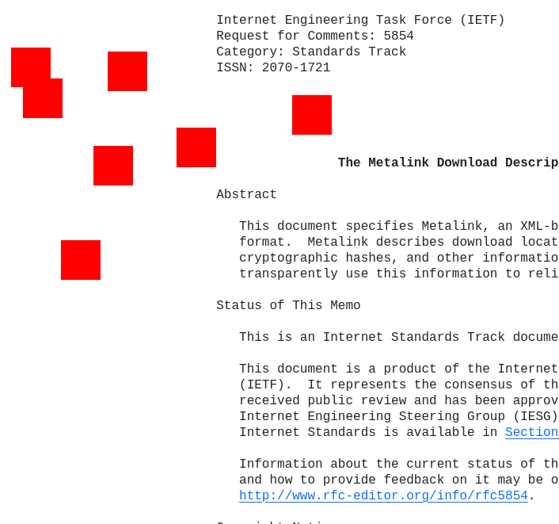

# link-selection
Select links

**_WORK IN PROGRESS_**

Currently draws a box for the selection through first clicking the mouse for the first corner point and then clicking opposite corner point to form a rectangular area.

